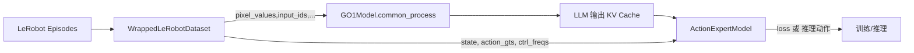
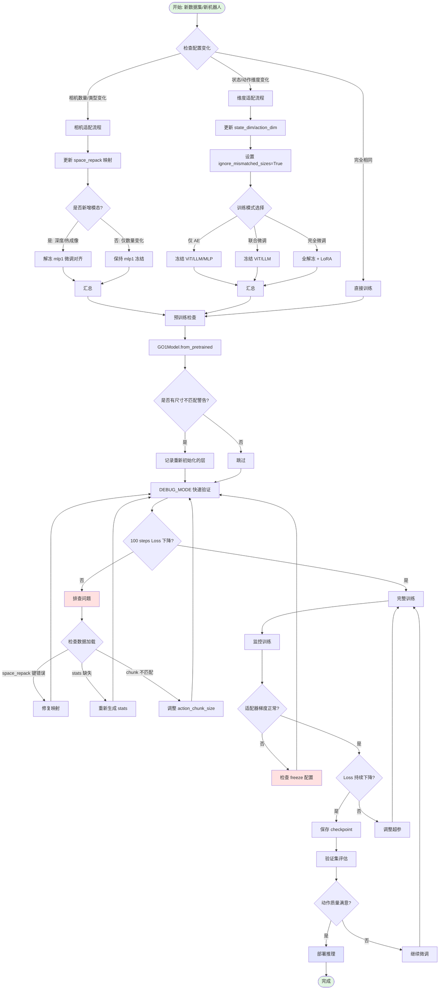

# GO-1 自定义数据接入与 Action Expert 微调指南

> 本文档围绕 GO-1 项目的数据接入与微调流程展开，并兼顾 LeRobot v2.1 与 v3.0 版本的兼容策略。全文分为三章：
> 1. **第一章：基础流程** —— 讲解现有仓库中 GO-1 训练脚本所依赖的 v2.1 数据格式与微调步骤，**新增详细的输入配置适配机制分析**。
> 2. **第二章：v3.0 适配指南** —— 结合 `lerobot_latest` 最新源码解析 v3.0 的变化与迁移策略。
> 3. **第三章：官方文档笔记** —— 将你提供的官方文档逐篇拆解成可操作要点，无需再回原网页查阅。

---

## 🔥 第一章核心更新：输入配置适配机制深度解析

### 📋 新增内容概览

本次更新在第一章中新增 **1.10 节「模型对不同输入配置的适配机制深度解析」**，详细剖析了 GO-1 如何处理以下场景：

1. **相机数量/模态变化**：单目 → 多目、RGB → RGB+深度
2. **状态/动作维度变化**：单臂 7DOF → 双臂 14DOF
3. **不同训练模式**：完全冻结、部分微调、联合训练、从头训练
4. **预训练模型适配**：`ignore_mismatched_sizes` 机制解析

### 🎯 关键发现总结

#### 1. 图像输入弹性机制

```python
# 数据加载层通过键值检查实现动态适配
for cam_key in cam_keys:
    if cam_key in raw_target:  # ← 核心：存在性检查
        num_image += 1
        images.append(raw_target[cam_key])

# 自动生成对应数量的 <image> 占位符
conversation = f"{'<image>' * num_image}{prompt}"
```

**结论**：
- ✅ 缺失相机自动跳过，不会报错
- ✅ 新增相机无需修改模型结构
- ✅ ViT 按顺序编码所有图像，与相机数量解耦

#### 2. 维度变化适配机制

```python
# state_adaptor 和 action_adaptor 根据配置动态初始化
self.state_adaptor = nn.Sequential(
    nn.Linear(config.state_dim, hidden_size),  # ← 维度从配置读取
    ...
)

# 预训练加载时允许尺寸不匹配
model = GO1Model.from_pretrained(
    ...,
    ignore_mismatched_sizes=True,  # ← 关键参数
)
```

**受影响层列表**：
- `state_adaptor[0].weight`: `(1024, old_state_dim)` → `(1024, new_state_dim)` ✅ 重新初始化
- `action_adaptor[0].weight`: `(1024, old_action_dim)` → `(1024, new_action_dim)` ✅ 重新初始化
- `final_layer.*.weight`: `(..., old_action_dim)` → `(..., new_action_dim)` ✅ 重新初始化
- `vision_model.*`, `language_model.*`, `action_model.*` (Transformer) ❌ 保持预训练权重

**结论**：
- ✅ 仅适配器层重新初始化，核心模块保留预训练能力
- ✅ Action Expert Transformer 处理固定维度隐空间，与输入维度解耦
- ⚠️ 重新初始化的层需要重新训练（通常 1-2K steps 收敛）

#### 3. 分层训练模式支持

| 训练模式               | 可训练参数 | 适用场景                    | 显存需求 | 推荐学习率 |
| ---------------------- | ---------- | --------------------------- | -------- | ---------- |
| **完全冻结**（DEBUG）  | ~300M      | 快速验证 pipeline           | 22 GB    | 2e-5       |
| **仅 AE 微调**（推荐） | ~600M      | 状态/动作维度变化、新机器人 | 22 GB    | 2e-5       |
| **AE + MLP 联合**      | ~800M      | 相机数量增加、新增模态      | 28 GB    | 1e-5       |
| **AE + MLP + ViT**     | ~6.5B      | 大域偏移（仿真→真实）       | 35 GB    | 5e-6       |
| **全模型微调**         | ~13.5B     | 完全新任务（需 >1M 样本）   | 80 GB+   | 1e-5       |

### 📊 实践案例对比

#### 案例 1：LIBERO → AgileX（维度 7→14）

**配置变化**：
```python
# 原: state_dim=8, action_dim=7, 2 相机
# 新: state_dim=14, action_dim=14, 3 相机
```

**训练日志关键信息**：
```
Some weights were not initialized (shape mismatch):
  - state_adaptor.0.weight: (1024, 8) → (1024, 14)
  - action_adaptor.0.weight: (1024, 7) → (1024, 14)
  
Trainable: 342.98M (state_adaptor + action_adaptor + action_model + final_layer)
Frozen: 13,524.12M (vision + language + mlp1)
```

**收敛曲线特征**：
- 0-500 steps: Loss 快速下降（适配器学习映射）
- 500-2000 steps: 平稳下降（Action Expert 学习新动作分布）
- 2000+ steps: 缓慢优化（扩散模型精细调整）

#### 案例 2：单目 → 三目（仅相机增加）

**模型行为**：
- ViT 输出: `(196, 1024)` → `(588, 1024)` (3×196 patches)
- LLM token 序列: `~200` → `~600` (3个 `<image>` 占位符)
- **无需重新训练适配器**，但建议解冻 `mlp1` 微调 1-2 epoch

### 🛠️ 新增工具与技巧

#### 1. DEBUG_MODE 快速验证

```bash
DEBUG_MODE=true RUNNAME=debug_test bash go1/shell/train.sh config.py
```

自动配置：
- `batch_size=2`（减少显存）
- `num_workers=0`（简化调试）
- 冻结 ViT/LLM/MLP
- `_fast_init=True`（跳过权重加载）

#### 2. 适配器梯度监控

```python
# 每 100 steps 检查梯度
state_grad_norm = torch.norm(model.state_adaptor[0].weight.grad)
logger.info(f"state_grad={state_grad_norm:.4f}")
```

正常范围：0.01 ~ 1.0  
异常情况：=0（被冻结）或 >1e3（梯度爆炸）

#### 3. 完整适配流程图

新增详细的 Mermaid 流程图（见 1.10.8 节），涵盖：
- 配置检查分支
- 适配策略选择
- 问题排查路径
- 训练监控要点

### 📚 新增参考表格

1. **快速配置参考表**（1.10.9 节）：7 种典型场景的完整配置
2. **显存需求估算表**：不同配置下的显存占用与硬件推荐
3. **多卡训练建议**：DeepSpeed ZeRO-1/2/3 配置指南

### 🔗 章节导航

- **1.10.1**：核心设计理念
- **1.10.2**：图像数量/模态变化处理机制
- **1.10.3**：状态/动作维度变化处理机制
- **1.10.4**：不同训练模式下的模型行为
- **1.10.5**：实践案例分析
- **1.10.6**：调试技巧与常见陷阱
- **1.10.7**：推荐实践流程
- **1.10.8**：完整适配流程图
- **1.10.9**：快速配置参考表

---

## 第一章：GO-1 数据接入与 Action Expert 微调流程（基于 LeRobot v2.1）

### 1.1 训练流水线全景

- **视觉编码 (ViT)**：`InternVisionModel` 处理多路相机画面，输出 patch 序列后经 `mlp1` 映射至 LLM 隐空间。
- **语言模型 (LLM)**：`InternLM2ForCausalLMGO1` 接收视觉 token 与文本 prompt，生成跨模态上下文并返回 KV Cache。
- **动作专家 (Action Expert, AE)**：`ActionExpertModel` 读取 KV Cache 与状态信息，作为扩散头预测动作 chunk；若开启 Latent Planner，会先生成离散潜变量辅助动作生成。
- **数据层**：`WrappedLeRobotDataset` 负责加载 LeRobot 数据集、做字段映射、图像增广/归一化，并组装 `pixel_values`、`state`、`action_gts` 等张量。



### 1.2 模型输入契约（Action Expert 视角）

| 名称             | 维度 / 类型                             | 含义                                                | 产生位置                                   |
| ---------------- | --------------------------------------- | --------------------------------------------------- | ------------------------------------------ |
| `pixel_values`   | `(N_img_tiles, 3, H, W)`，`float32`     | 多路相机图像，默认 448×448，经增广和归一化          | `build_transform` & `multi_image_get_item` |
| `input_ids`      | `(1, seq_len)`，`int64`                 | 上下文 prompt 的 token 序列，包含图像占位 `<image>` | `preprocess_internvl2_5`                   |
| `attention_mask` | `(1, seq_len)`，`bool`                  | LLM 注意力掩码                                      | `preprocess_internvl2_5`                   |
| `position_ids`   | `(1, seq_len)`，`int64`                 | Rotary 位置编码索引                                 | 同上                                       |
| `image_flags`    | `(N_img_tiles, 1)`，`int64`             | 标记哪些 token 需要用视觉特征替换                   | `multi_image_get_item`                     |
| `state`          | `(1, state_dim)`，`float32`             | 机器人当前低维状态/本体观测                         | `space_repack['state']`                    |
| `ctrl_freqs`     | `(1, 1)`，`float32`                     | 控制频率（Hz），由配置固定                          | `SpaceArguments.ctrl_freq`                 |
| `action_gts`     | `(action_chunk, action_dim)`，`float32` | 监督信号，扩散重构目标                              | `space_repack['action']`                   |

> 训练模式下必须提供 `action_gts`；推理模式下模型内部通过扩散采样 (`condition_sample`) 生成动作轨迹。

### 1.3 LeRobot 数据集基础要求

1. **目录结构**（示例）：
     ```text
     <DATA_ROOT>/
         ├── data_config.json
         ├── metadata.json             # 包含 state/action 统计量
         ├── episode_000000/
         │     ├── frames/
         │     │     ├── 000000.npz
         │     │     └── ...
         │     └── episode.json
         └── episode_000001/
                     └── ...
     ```
     `LeRobotDataset.create(...)` 会自动生成 `stats`、`metadata` 与 episode 目录。

2. **特征定义**：在 `create` 时声明每个键的 `dtype` 与 `shape`。官方示例：
     - LIBERO (`evaluate/libero/convert_libero_data_to_lerobot.py`)：提供 `image`、`wrist_image`、`state`、`actions`。
     - AgileX (`evaluate/agilex/convert_agilex_data_to_lerobot.py`)：多路相机 + 14 维动作。

3. **时间对齐与 chunk**：`WrappedLeRobotDataset` 根据 `action_chunk_size` 提取连续帧并组装 `(chunk, action_dim)`。需确保：
     - 采样频率与 `SpaceArguments.ctrl_freq` 一致。
     - `chunk == action_chunk_size`，与数据帧率对应（10Hz → 10，30Hz → 30）。

4. **可选文本指令**：若数据含任务语言描述，可写入自定义键（例：`task`）。若没有，可用 `SpaceArguments.default_prompt` 指定统一默认指令。

5. **统计量 (stats)**：当配置中开启 `Normalize` 时，训练脚本会读取 `metadata.json` 的 `mean/std` 并在 checkpoint 中导出 `dataset_stats.json`，供部署阶段归一化使用。

### 1.4 数据写入实操

**Step 1：定义 schema**

```python
from lerobot.common.datasets.lerobot_dataset import LeRobotDataset

CUSTOM_FEATURES = {
        "image": {"dtype": "image", "shape": (256, 256, 3), "names": ["height", "width", "channel"]},
        "wrist_image": {"dtype": "image", "shape": (256, 256, 3)},
        "state": {"dtype": "float32", "shape": (8,)},
        "actions": {"dtype": "float32", "shape": (7,)},
}

dataset = LeRobotDataset.create(
        repo_id="my_robot/run_001",
        root="/path/to/lerobot/root",
        robot_type="custom",
        fps=10,
        features=CUSTOM_FEATURES,
        image_writer_threads=10,
        image_writer_processes=4,
)
```

**Step 2：写入 episode/frame**

```python
for episode in raw_episodes:
        for step in episode:
                dataset.add_frame(
                        {
                                "image": step["cam_front"],
                                "wrist_image": step["cam_wrist"],
                                "state": step["robot_state"],
                                "actions": step["action"],
                        },
                        task=step.get("language_instruction", "pick the object"),
                )
        dataset.save_episode()
```

- `add_frame` 期待原始单帧数据，无需自行拼 chunk。
- `task` 会写入 `final_prompt`，训练时转换为 “What action should the robot take to ...?”。
- 若存在多路相机，可按下节映射。

**多路相机映射示例**

```python
CUSTOM_FEATURES = {
        "observation.images.front": {"dtype": "image", "shape": (480, 640, 3)},
        "observation.images.left_wrist": {"dtype": "image", "shape": (480, 640, 3)},
        "observation.images.right_wrist": {"dtype": "image", "shape": (480, 640, 3)},
        "state": {"dtype": "float32", "shape": (8,)},
        "actions": {"dtype": "float32", "shape": (7,)},
}

space_repack = {
        "state": "state",
        "action": "actions",
        "cam_head_color": "observation.images.front",
        "cam_hand_left_color": "observation.images.left_wrist",
        "cam_hand_right_color": "observation.images.right_wrist",
}
```

- 仅有两路相机时，可删除未使用键：例如只留下 `cam_head_color`、`cam_hand_left_color`。
- 若需更多相机，可在 `WrappedLeRobotDataset.multi_image_get_item` 中自定义 `cam_keys`，或在转换阶段拼接图像。

**Step 3：质检**

- `python scripts/visualize_dataset.py --task-id <id> --dataset-path <path>` 预览图像/动作。
- 检查 `metadata.json` 中是否存在 `state`、`actions` 的 `mean/std`。

### 1.5 SpaceArguments 映射与常见场景

```python
space_repack = {
        "state": "state",
        "action": "actions",
        "cam_head_color": "image",
        "cam_hand_left_color": "wrist_image",
        # 可选: "final_prompt": "task"
}
```

- **单路相机**：所有相机键映射到同一图像字段，缺失键自动跳过。
- **无语言指令**：移除 `final_prompt` 映射，并在 `default_prompt` 中填默认指令。
- **额外模态**：深度图/热力图可在转换脚本中生成 `PIL.Image`，并映射到新的 cam 键。

### 1.6 动作 chunk 与控制频率

- `GOModelArguments.action_chunk_size` 定义 AE 每次预测的时间窗口：30Hz 数据 → 30；10Hz → 10。
- `SpaceArguments.ctrl_freq` 表示采样频率，会以 token 形式注入 AE。
- 若帧率为 15Hz，可设 `action_chunk_size=15`、`ctrl_freq=15`，或在数据阶段做插值/丢帧。

### 1.7 仅微调 Action Expert 的配置建议

```python
@dataclass
class GOModelArguments(BaseModelArguments):
        model_name_or_path: str = "agibot-world/GO-1"
        action_chunk_size: int = 10
        latent_planning: bool = True
        freeze_backbone: bool = True
        freeze_llm: bool = True
        freeze_mlp: bool = True
        freeze_latent_planner: bool = True
```

- 如需联合微调 Latent Planner，将 `freeze_latent_planner=False` 并准备更高显存。

`SpaceArguments` 示例：

```python
@dataclass
class SpaceArguments(BaseSpaceArguments):
        state_dim: int = 8
        action_dim: int = 7
        ctrl_freq: int = 10
        space_repack: dict = field(
                default_factory=lambda: {
                        "state": "state",
                        "action": "actions",
                        "cam_head_color": "image",
                        "cam_hand_left_color": "wrist_image",
                        "final_prompt": "task",
                }
        )
```

启动训练：

```bash
RUNNAME=my_custom_run \
DEBUG_MODE=false \
bash go1/shell/train.sh go1/configs/go1_ae_custom.py
```

- 默认使用 DeepSpeed zero1。首次运行会在 `experiment/<RUNNAME>/` 输出日志、checkpoint、`dataset_stats.json`。

### 1.8 完整微调操作流程（Checklist）

1. **环境准备**
     ```bash
     conda create -n go1 python=3.10 -y
     conda activate go1
     pip install -e .
     pip install --no-build-isolation flash-attn==2.4.2
     ```
     如需转换 RLDS，可单独创建环境并安装 TensorFlow 依赖。

2. **数据转换**：按 1.4 的流程写入 episode，确认 `metadata.json` 与 `dataset_stats.json`。

3. **快速质检**：使用 `visualize_dataset.py` 与脚本抽查统计量。

4. **配置复制**：从 `go1/configs/go1_sft_libero.py` 拷贝并修改路径/超参。

5. **冻结策略**：在配置中设置 `freeze_*` 参数，确保仅 AE 可训练。

6. **启动训练**：使用 `train.sh`，可通过环境变量调试（`DEBUG_MODE=true` 会缩小 batch）。

7. **监控日志**：使用 TensorBoard 或 `tail -f` 观测 loss；根据显存调节 `per_device_train_batch_size` / `gradient_accumulation_steps`。

8. **保存与推理**：训练完成后在 `experiment/<RUNNAME>/checkpoint-*` 获取模型与 `dataset_stats.json`，可调用 `GO1Infer` 做本地或远程推理。

### 1.9 数据质量与调试建议

- **归一化验证**：确认 `dataset.stats` 中存在 `mean/std`。推理时若缺失，会导致动作尺度失真。
- **指令覆盖率**：缺少语言指令时，模型退化为视觉控制，建议至少提供场景描述。
- **任务平衡**：混合多数据集时，先在转换脚本中做任务标签均衡或加权采样。
- **可视化审查**：使用 rerun.io 或自建 notebook 逐帧检查；发现错帧时回溯转换脚本。
- **调试模式**：`DEBUG_MODE=true` 会冻结大部分模块并减小 batch，用于快速验证 pipeline。

### 1.10 模型对不同输入配置的适配机制深度解析

#### 1.10.1 核心设计理念

GO-1 模型采用**模块化架构 + 动态适配层**的设计，允许在保留预训练权重的同时灵活调整输入/输出规格。核心策略包括：

1. **视觉输入弹性**：通过键值存在性检查实现相机数量动态适配
2. **维度自适应层**：`state_adaptor` 和 `action_adaptor` 作为可重新初始化的接口层
3. **分层冻结机制**：支持从完全冻结到全模型微调的多级训练模式
4. **尺寸不匹配容忍**：通过 `ignore_mismatched_sizes=True` 允许关键层重新初始化

---

#### 1.10.2 图像数量/模态变化处理机制

**数据加载层处理（`WrappedLeRobotDataset.__getitem__`）**：

```python
# 源码位置: go1/lerobot/dataset_lerobot.py:272-292
def __getitem__(self, index):
    raw_data = self.dataset[index]
    raw_target = {}
    
    # 关键设计：仅加载 space_repack 中声明的相机
    if "cam_head_color" in self.space_args.space_repack:
        raw_target["cam_head_color"] = tensor_to_pil(
            raw_data[self.space_args.space_repack["cam_head_color"]].permute(1, 2, 0)
        )
    if "cam_hand_right_color" in self.space_args.space_repack:
        raw_target["cam_hand_right_color"] = tensor_to_pil(...)
    if "cam_hand_left_color" in self.space_args.space_repack:
        raw_target["cam_hand_left_color"] = tensor_to_pil(...)
    
    # 传递给 multi_image_get_item 进一步过滤
    results = self.multi_image_get_item(raw_target=raw_target, ...)
```

**视觉特征提取层处理（`multi_image_get_item`）**：

```python
# 源码位置: go1/lerobot/dataset_lerobot.py:197-227
@staticmethod
def multi_image_get_item(
    raw_target: Dict[str, Any],
    cam_keys: List[str] = [
        "cam_head_color",
        "cam_hand_right_color", 
        "cam_hand_left_color"
    ],
    ...
):
    images, num_tiles = [], []
    num_image = 0
    
    # 关键设计：通过存在性检查动态跳过缺失相机
    for cam_key in cam_keys:
        if cam_key in raw_target:  # ← 核心判断逻辑
            num_image += 1
            if dynamic_image_size:
                image = dynamic_preprocess(raw_target[cam_key], ...)
                images += image
                num_tiles.append(len(image))
            else:
                images.append(raw_target[cam_key])
                num_tiles.append(1)
    
    # 根据实际相机数量生成 <image> 占位符
    conversation = [
        {
            "from": "human",
            "value": f"{'<image>' * num_image}{raw_target['final_prompt']}",
        },
        ...
    ]
```

**实际效果与场景示例**：

| 场景                     | `space_repack` 配置                                                            | 实际加载相机数 | 模型行为                                      |
| ------------------------ | ------------------------------------------------------------------------------ | -------------- | --------------------------------------------- |
| **单目相机**             | `{"cam_head_color": "image"}`                                                  | 1              | 生成 `<image>` × 1，ViT 处理单张图            |
| **双目相机**             | `{"cam_head_color": "front", "cam_hand_left_color": "wrist"}`                  | 2              | 生成 `<image>` × 2，拼接为 `(2, 3, 448, 448)` |
| **三目相机（AgileX）**   | `{"cam_head_color": "cam_high", "cam_hand_left_color": "cam_left_wrist", ...}` | 3              | 生成 `<image>` × 3                            |
| **缺失某相机**           | `{"cam_head_color": "front"}` 但数据集只有 `wrist`                             | 0              | 跳过该样本或报错（取决于 error handling）     |
| **增加相机（超过预设）** | 修改 `cam_keys` 列表添加 `cam_depth`、`cam_thermal` 等                         | 4+             | 正常处理，ViT 按顺序编码所有图像              |

**注意事项**：

- ViT 不关心相机数量，仅处理拼接后的 `pixel_values` 张量。
- LLM 通过 `<image>` 占位符数量感知视觉输入，token 序列长度会动态调整。
- 若预训练模型见过 N 路相机，新增至 N+M 路时**无需额外训练视觉编码器**，但 LLM 的视觉-语言对齐可能需微调。

---

#### 1.10.3 状态/动作维度变化处理机制

**适配器设计（`GO1Model.__init__`）**：

```python
# 源码位置: go1/internvl/model/go1/modeling_go1.py:267-305
self.state_adaptor = nn.Sequential(
    nn.Linear(
        action_config.state_dim,  # ← 从配置动态读取
        action_config.hidden_size,
        dtype=self.torch_dtype,
    ),
    nn.GELU(approximate="tanh"),
    nn.Linear(action_config.hidden_size, action_config.hidden_size, ...),
    nn.GELU(approximate="tanh"),
    nn.Linear(action_config.hidden_size, action_config.hidden_size, ...),
)

self.action_adaptor = nn.Sequential(
    nn.Linear(
        action_config.action_dim,  # ← 从配置动态读取
        action_config.hidden_size,
        dtype=self.torch_dtype,
    ),
    nn.GELU(...),
    ...
)

self.final_layer = FinalLayer(action_hidden_size, self.action_dim).to(...)
```

**配置构建逻辑（`build_ae_config`）**：

```python
# 源码位置: go1/internvl/train/go1_train.py:175-220
def build_ae_config(model_args, go1_config, space_args) -> ActionExpertConfig:
    llm_config_dict = go1_config.llm_config.to_dict()
    action_config_dict = deepcopy(llm_config_dict)
    
    # 移除 LLM 特有配置（如 vocab_size, tokenizer_class 等）
    for key in (...):
        action_config_dict.pop(key, None)
    
    # 覆盖为 Action Expert 专用配置
    action_config_dict["action_dim"] = space_args.action_dim      # ← 新维度
    action_config_dict["state_dim"] = space_args.state_dim        # ← 新维度
    action_config_dict["action_chunk_size"] = model_args.action_chunk_size
    action_config_dict["state_token_num"] = 3  # time + ctrl_freq + state
    
    return ActionExpertConfig(**action_config_dict)
```

**预训练权重加载与尺寸不匹配处理**：

```python
# 源码位置: go1/internvl/train/go1_train.py:318-323
model = GO1Model.from_pretrained(
    model_args.model_name_or_path,
    config=config,  # ← 已更新为新的 state_dim/action_dim
    torch_dtype=torch_dtype,
    ignore_mismatched_sizes=True,  # ← 关键参数！
)
```

**`ignore_mismatched_sizes=True` 的实际效果**：

HuggingFace Transformers 的 `from_pretrained` 在加载权重时会：

1. **逐层匹配**：尝试将 checkpoint 中的权重加载到当前模型对应层
2. **维度检查**：若某层权重形状不匹配（如 `state_adaptor[0].weight` 从 `(1024, 8)` 变为 `(1024, 14)`）
3. **处理策略**：
   - `ignore_mismatched_sizes=False`（默认）：抛出 `RuntimeError`
   - `ignore_mismatched_sizes=True`：跳过该层加载，**使用新初始化的随机权重**

**受影响的层列表**：

| 模块                           | 预训练维度示例       | 新维度示例（AgileX） | 是否重新初始化 |
| ------------------------------ | -------------------- | -------------------- | -------------- |
| `state_adaptor[0].weight`      | `(1024, 8)`          | `(1024, 14)`         | ✅ 是           |
| `state_adaptor[0].bias`        | `(1024,)`            | `(1024,)`            | ✅ 是           |
| `action_adaptor[0].weight`     | `(1024, 7)`          | `(1024, 14)`         | ✅ 是           |
| `action_adaptor[0].bias`       | `(1024,)`            | `(1024,)`            | ✅ 是           |
| `final_layer.ffn_final.fc2`    | `(..., 7)`           | `(..., 14)`          | ✅ 是           |
| `vision_model.*`               | 不变                 | 不变                 | ❌ 否           |
| `language_model.*`             | 不变                 | 不变                 | ❌ 否           |
| `action_model.* (Transformer)` | 不变（仅处理隐空间） | 不变                 | ❌ 否           |

**关键结论**：

- **状态/动作维度变化仅影响适配器层**，不会破坏预训练的视觉编码器和语言模型权重。
- **Action Expert 主体（Transformer 层）** 处理的是固定维度的隐空间 token（如 `(B, horizon+3, 1024)`），与输入维度解耦。
- **重新初始化的层需要重新训练**，但由于适配器仅 3 层 MLP，收敛速度较快（通常 1-2K steps 即可稳定）。

---

#### 1.10.4 不同训练模式下的模型行为

**模式 1：完全冻结（调试/快速验证）**

```python
@dataclass
class GOModelArguments(BaseModelArguments):
    freeze_backbone: bool = True   # 冻结 ViT
    freeze_llm: bool = True         # 冻结 LLM
    freeze_mlp: bool = True         # 冻结 mlp1（视觉-语言映射）
    freeze_latent_planner: bool = True  # 冻结潜变量规划器（如果启用）
```

- **可训练参数**：仅 `state_adaptor`、`action_adaptor`、`final_layer`、`action_model`（约 300M）
- **适用场景**：
  - `DEBUG_MODE=true` 快速验证数据加载 pipeline
  - 新任务与预训练任务极度相似，仅需微调动作预测头
  - 显存受限（单卡 24GB 可训练）
- **风险**：若任务域偏移大（如从桌面操作迁移至工业场景），冻结 ViT 可能导致特征提取不足。

**模式 2：仅训练 Action Expert（推荐微调策略）**

```python
@dataclass
class GOModelArguments(BaseModelArguments):
    freeze_backbone: bool = True
    freeze_llm: bool = True
    freeze_mlp: bool = True
    freeze_latent_planner: bool = False  # ← 如果需要动态规划能力可解冻
```

- **可训练参数**：适配器 + Action Expert 完整 Transformer + Latent Planner（约 600M）
- **训练建议**：
  - 学习率设置为 `2e-5`（与配置文件一致）
  - Warmup steps: 1000（让适配器先收敛）
  - 批量大小：16-32（视显存而定，使用梯度累积）
- **适用场景**：
  - 状态/动作维度变化
  - 新机器人本体（需重新学习状态-动作映射）
  - 保留视觉理解能力，专注于控制策略优化

**模式 3：联合微调 MLP（视觉-语言对齐增强）**

```python
@dataclass
class GOModelArguments(BaseModelArguments):
    freeze_backbone: bool = True
    freeze_llm: bool = True
    freeze_mlp: bool = False  # ← 解冻视觉-语言映射层
    freeze_latent_planner: bool = False
```

- **可训练参数**：mlp1 + 适配器 + Action Expert + Latent Planner（约 800M）
- **适用场景**：
  - 相机数量增加（3 路 → 5 路）
  - 相机视角剧烈变化（第三人称 → 第一人称）
  - 新增模态（RGB + 深度 → RGB + 深度 + 热成像）
- **训练建议**：
  - 学习率降至 `1e-5`（避免破坏预训练对齐）
  - 使用余弦退火调度器
  - 监控 LLM 输出的 KV Cache 质量（通过中间层激活值可视化）

**模式 4：部分解冻 ViT（大域偏移场景）**

```python
@dataclass
class GOModelArguments(BaseModelArguments):
    freeze_backbone: bool = False  # ← 解冻 ViT
    freeze_llm: bool = True
    freeze_mlp: bool = False
    # 可选：在 GO1Model 中设置 vision_model 仅训练最后几层
```

- **适用场景**：
  - 从仿真数据迁移至真实环境
  - 光照/纹理分布巨大差异
  - 相机传感器类型变化（工业相机 → 鱼眼相机）
- **显存需求**：单卡 40GB+，推荐使用 DeepSpeed ZeRO-2
- **训练建议**：
  - ViT 学习率设为 `5e-6`（远低于 AE）
  - 使用差异化学习率（通过 `param_groups` 设置）
  - 监控过拟合风险（ViT 参数量大，易在小数据集上过拟合）

**模式 5：完全微调（从头训练或大规模迁移）**

```python
@dataclass
class GOModelArguments(BaseModelArguments):
    freeze_backbone: bool = False
    freeze_llm: bool = False  # ← 解冻 LLM（慎用！）
    freeze_mlp: bool = False
    freeze_latent_planner: bool = False
```

- **适用场景**：
  - 数据集规模 > 1M 样本
  - 任务类型完全不同（如从桌面操作迁移至人形机器人全身控制）
  - 语言指令系统需要重新训练（多语言、领域特定术语）
- **风险警告**：
  - LLM 参数量极大（InternLM2-7B 约 7B 参数），解冻后需 80GB+ 显存（ZeRO-3 + 卸载）
  - 可能破坏预训练的语言理解能力
  - 需要大量高质量语言-动作对齐数据
- **替代方案**：优先考虑 LoRA 微调（通过 `use_llm_lora` 参数）

---

#### 1.10.5 实践案例分析

**案例 1：LIBERO → AgileX 双臂（维度 7 → 14）**

```python
# 配置变化
# LIBERO: state_dim=8, action_dim=7, 2 相机
# AgileX: state_dim=14, action_dim=14, 3 相机

@dataclass
class SpaceArguments(BaseSpaceArguments):
    state_dim: int = 14  # ← 从 8 变为 14
    action_dim: int = 14  # ← 从 7 变为 14
    space_repack: dict = field(
        default_factory=lambda: {
            "state": "observation.state",
            "action": "action",
            "cam_head_color": "observation.images.cam_high",
            "cam_hand_left_color": "observation.images.cam_left_wrist",
            "cam_hand_right_color": "observation.images.cam_right_wrist",  # ← 新增
        }
    )
```

**训练日志分析**（首次运行时的关键输出）：

```
Loading GO1Model...
Some weights of GO1Model were not initialized from the model checkpoint:
  - state_adaptor.0.weight (shape mismatch: checkpoint (1024, 8) vs config (1024, 14))
  - action_adaptor.0.weight (shape mismatch: checkpoint (1024, 7) vs config (1024, 14))
  - final_layer.ffn_final.fc2.weight (shape mismatch: checkpoint (..., 7) vs config (..., 14))
These weights are initialized randomly and need to be trained!

Module parameters:
  vision_model:    Total: 5905.92M  Trainable: 0.00M  Frozen: 5905.92M
  language_model:  Total: 7349.76M  Trainable: 0.00M  Frozen: 7349.76M
  mlp1:            Total: 268.44M   Trainable: 0.00M  Frozen: 268.44M
  state_adaptor:   Total: 21.02M    Trainable: 21.02M  Frozen: 0.00M  # ← 随机初始化
  action_adaptor:  Total: 21.02M    Trainable: 21.02M  Frozen: 0.00M  # ← 随机初始化
  action_model:    Total: 293.60M   Trainable: 293.60M  Frozen: 0.00M
  final_layer:     Total: 7.34M     Trainable: 7.34M   Frozen: 0.00M  # ← 随机初始化
```

**收敛曲线特征**：

- **前 500 steps**：Loss 快速下降（适配器学习输入-隐空间映射）
- **500-2000 steps**：Loss 平稳下降（Action Expert 学习新的动作分布）
- **2000+ steps**：Loss 进入缓慢优化阶段（扩散模型精细调整）

**案例 2：单目 → 三目（相机数量变化）**

```python
# 配置变化
# 原: 1 相机 (cam_head_color)
# 新: 3 相机 (cam_head_color + cam_hand_left_color + cam_hand_right_color)

# space_repack 保持不变，模型自动适配
```

**模型行为**：

- ViT 按顺序编码 3 张图像，输出 `(3*196, 1024)` 的 patch 序列（假设每张图 196 个 patch）
- LLM 的 `input_ids` 中包含 `<image>` × 3，token 序列长度从 `~200` 增加至 `~600`
- Action Expert 接收更丰富的 KV Cache，但自身结构不变
- **无需重新训练适配器**，但建议解冻 `mlp1` 微调视觉-语言对齐（约 1-2 epoch）

**案例 3：添加深度图模态**

```python
# 数据转换阶段
CUSTOM_FEATURES = {
    "observation.images.rgb": {"dtype": "image", "shape": (480, 640, 3)},
    "observation.images.depth": {"dtype": "image", "shape": (480, 640, 3)},  # ← 深度图转为伪彩色
    ...
}

# 配置
space_repack = {
    ...
    "cam_head_color": "observation.images.rgb",
    "cam_hand_left_color": "observation.images.depth",  # ← 将深度图映射到手腕相机位置
}
```

**注意事项**：

- ViT 预训练于 RGB 图像，直接输入深度图可能导致特征提取失效
- 建议在转换脚本中将深度图归一化并应用伪彩色映射（如 JET colormap）
- 或者修改 `multi_image_get_item`，为深度图添加独立的归一化参数

---

#### 1.10.6 调试技巧与常见陷阱

**技巧 1：使用 `DEBUG_MODE` 快速验证配置**

```bash
DEBUG_MODE=true \
RUNNAME=debug_test \
bash go1/shell/train.sh go1/configs/your_config.py
```

- 自动设置：
  - `per_device_train_batch_size=2`（减少显存占用）
  - `dataloader_num_workers=0`（避免多进程调试困难）
  - `freeze_backbone=True`, `freeze_llm=True`, `freeze_mlp=True`（仅训练 AE）
  - `_fast_init=True`（跳过权重加载，使用随机初始化）

**技巧 2：监控适配器训练状态**

```python
# 在训练循环中添加
if step % 100 == 0:
    state_grad_norm = torch.norm(model.state_adaptor[0].weight.grad)
    action_grad_norm = torch.norm(model.action_adaptor[0].weight.grad)
    logger.info(f"Step {step}: state_grad={state_grad_norm:.4f}, action_grad={action_grad_norm:.4f}")
```

- 若梯度长期为 0，检查 `freeze_*` 配置
- 若梯度爆炸（>1e3），降低学习率或使用梯度裁剪

**技巧 3：可视化 KV Cache 质量**

```python
# 在 forward 后添加
vlm_key_values = vlm_outputs.past_key_values
layer_0_key_mean = vlm_key_values[0][0].mean().item()
logger.info(f"Layer 0 KV mean: {layer_0_key_mean:.4f}")
```

- 正常范围：-0.5 ~ 0.5
- 若接近 0，说明 LLM 输出退化，可能需要解冻 LLM

**常见陷阱 1：忘记更新 `action_chunk_size`**

```python
# 错误示例
# 数据集 FPS=30，但配置中 action_chunk_size=10
@dataclass
class GOModelArguments(BaseModelArguments):
    action_chunk_size: int = 10  # ← 应为 30！
```

- **现象**：训练正常，但推理时动作序列长度不匹配
- **排查**：检查 `dataset_stats.json` 中的 action shape

**常见陷阱 2：`space_repack` 键名拼写错误**

```python
# 错误示例
space_repack = {
    "state": "observation.state",
    "action": "actions",  # ← 数据集中为 "action" 而非 "actions"
}
```

- **现象**：`KeyError: 'actions'`
- **排查**：使用 `scripts/visualize_dataset.py` 检查数据集键名

**常见陷阱 3：归一化统计量缺失**

```python
# 错误示例
transforms: Optional[List[str]] = field(default_factory=lambda: [])  # ← 未开启 Normalize
```

- **现象**：推理时动作尺度异常（全为 0 或超出关节限位）
- **排查**：检查 `dataset_stats.json` 是否存在，确认 `mean/std` 非空

---

#### 1.10.7 推荐实践流程

**Step 1：配置审查清单**

- [ ] `state_dim` / `action_dim` 与数据集特征维度一致
- [ ] `space_repack` 所有键在数据集中存在
- [ ] `action_chunk_size` == 数据集 FPS（或合理倍数）
- [ ] `ctrl_freq` == 数据集采样频率
- [ ] 至少存在一个相机映射（或使用 `default_prompt`）

**Step 2：小规模试训练（100 steps）**

```bash
DEBUG_MODE=true \
RUNNAME=sanity_check \
bash go1/shell/train.sh your_config.py
```

- 观察 Loss 是否下降
- 检查日志中的模块参数统计
- 确认无 CUDA OOM 或 NaN 梯度

**Step 3：单 epoch 完整训练**

```bash
DEBUG_MODE=false \
RUNNAME=pilot_run \
bash go1/shell/train.sh your_config.py
```

- 保存 checkpoint-1000
- 使用 `GO1Infer` 在验证集上测试
- 可视化预测动作与真值对比

**Step 4：全量训练与超参调优**

- 根据 pilot run 结果调整学习率、batch size
- 启用 WandB 或 TensorBoard 监控长期趋势
- 每 5K steps 做一次验证集评估

---

#### 1.10.8 完整适配流程图



**流程图说明**：

1. **配置检查阶段**：识别变化类型（相机/维度/无变化）
2. **适配策略选择**：根据变化类型选择对应的处理流程
3. **模型加载阶段**：处理尺寸不匹配警告，记录重新初始化的层
4. **调试验证阶段**：快速验证 100 steps，及早发现配置错误
5. **问题排查分支**：针对常见问题提供修复路径
6. **完整训练阶段**：监控梯度和 Loss，必要时调整超参
7. **评估部署阶段**：验证动作质量，决定是否继续微调

---

#### 1.10.9 快速配置参考表

| 场景                         | state_dim | action_dim | 相机数量 | freeze_backbone | freeze_llm | freeze_mlp | ignore_mismatched | 预期训练时长 (A100)  | 推荐学习率 |
| ---------------------------- | --------- | ---------- | -------- | --------------- | ---------- | ---------- | ----------------- | -------------------- | ---------- |
| **LIBERO 微调**              | 8         | 7          | 2        | True            | True       | True       | False             | ~2 小时 (10K steps)  | 2e-5       |
| **AgileX 双臂迁移**          | 14        | 14         | 3        | True            | True       | True       | **True**          | ~4 小时 (20K steps)  | 2e-5       |
| **单臂 → 双臂（维度翻倍）**  | 7→14      | 7→14       | 3        | True            | True       | True       | **True**          | ~5 小时 (25K steps)  | 2e-5       |
| **新增深度模态**             | 不变      | 不变       | 2→3      | True            | True       | **False**  | False             | ~6 小时 (30K steps)  | 1e-5       |
| **仿真 → 真实（域偏移）**    | 不变      | 不变       | 不变     | **False**       | True       | **False**  | False             | ~12 小时 (50K steps) | 5e-6       |
| **完全新机器人（重头训练）** | 自定义    | 自定义     | 自定义   | **False**       | **False**  | **False**  | **True**          | ~3 天 (100K steps)   | 1e-5       |
| **快速验证（DEBUG）**        | 任意      | 任意       | 任意     | True            | True       | True       | True              | ~10 分钟 (100 steps) | 2e-5       |

**列说明**：

- `ignore_mismatched`：是否设置 `ignore_mismatched_sizes=True`
- 预期训练时长：基于单卡 A100 40GB + batch_size=16 + gradient_accumulation_steps=1
- 学习率：初始学习率，通常配合 cosine 退火

**显存需求估算**（单卡，BF16 训练）：

| 配置                                    | 显存占用      | 推荐硬件             |
| --------------------------------------- | ------------- | -------------------- |
| 冻结 ViT/LLM/MLP + batch_size=16        | ~22 GB        | RTX 4090 / A100 40GB |
| 冻结 ViT/LLM + 解冻 MLP + batch_size=16 | ~28 GB        | A100 40GB            |
| 冻结 LLM + 解冻 ViT/MLP + batch_size=8  | ~35 GB        | A100 40GB            |
| 全解冻 + batch_size=4 + ZeRO-2          | ~45 GB        | A100 80GB / 多卡     |
| 全解冻 + batch_size=8 + ZeRO-3 + 卸载   | ~60 GB (峰值) | 2×A100 40GB          |

**多卡训练建议**：

- 2 卡：使用 DeepSpeed ZeRO-1，每卡 batch_size=16
- 4 卡：使用 DeepSpeed ZeRO-2，每卡 batch_size=8
- 8 卡：使用 DeepSpeed ZeRO-3，每卡 batch_size=4，启用 CPU 卸载

---

### 1.11 常见问题排查

| 现象                                  | 可能原因                                    | 建议                                                         |
| ------------------------------------- | ------------------------------------------- | ------------------------------------------------------------ |
| `KeyError: <field>`                   | `space_repack` 映射与数据集键名不一致       | 调整映射或统一转换脚本中的命名                               |
| `ValueError: Cannot find stats`       | `metadata.json` 缺失统计量或未更新          | 使用 `LeRobotDataset.create` 重采或手动补齐                  |
| `RuntimeError: action_chunk mismatch` | `action_chunk_size` 与帧率不匹配            | 调整 chunk 或在转换阶段做采样/插值                           |
| 推理结果发散                          | 未加载 `dataset_stats.json` 或 AE 未收敛    | 确认 `norm=True` 时提供 stats；延长训练或调小 lr             |
| `RuntimeError: size mismatch`         | 维度变化但未设置 `ignore_mismatched_sizes`  | 在 `from_pretrained` 添加该参数，允许重新初始化              |
| 训练 Loss 不下降                      | 适配器梯度为 0（可能被冻结）                | 检查 `freeze_*` 配置，确保目标模块可训练                     |
| 相机图像未加载                        | `space_repack` 中缺失对应键或数据集无该字段 | 用 `visualize_dataset.py` 检查数据集结构                     |
| CUDA OOM                              | 模型过大或 batch size 过高                  | 降低 `per_device_train_batch_size` 或启用 DeepSpeed ZeRO-2/3 |

---

## 第二章：LeRobot v3.0 适配指南（基于 `lerobot_latest`）

> 当前 GO-1 仓库使用 LeRobot v2.1，而 `lerobot_latest` 已升级至 v3.0。以下内容帮助你理解差异并平滑迁移。


| 维度         | v2.1                                           | v3.0（`lerobot_latest`）                                                   |
| ------------ | ---------------------------------------------- | -------------------------------------------------------------------------- |
| 元信息       | `metadata.json` + `stats.json` + episode jsonl | 统一放在 `meta/` 下，采用 parquet 分片（chunk/file）                       |
| 视觉数据     | 主要是 png（可扩展）                           | 同时支持 png 与 mp4，`camera_keys` 自动列出所有视觉模态                    |
| 默认特征     | 需要手动维护                                   | 自动附带 `timestamp`、`frame_index`、`episode_index` 等 `DEFAULT_FEATURES` |
| 写入效率     | 单线程写图 + 同步编码                          | 支持 `AsyncImageWriter`、`batch_encoding_size` 批量编码视频                |
| 时间采样     | 主要依赖 DataLoader 自行处理                   | `delta_timestamps` 原生支持在 Dataset 内部做时间窗口查询                   |
| 多数据集支持 | 需手动拼接                                     | `MultiLeRobotDataset` 自动对齐交集键并生成 dataset_index（仍属实验特性）   |

### 2.2 使用 v3.0 API 重新采集/转换数据

```python
from pathlib import Path
from lerobot.datasets.lerobot_dataset import LeRobotDataset

FEATURES_V3 = {
        "observation.images.front": {"dtype": "image", "shape": (480, 640, 3)},
        "observation.images.left_wrist": {"dtype": "image", "shape": (480, 640, 3)},
        "observation.state": {"dtype": "float32", "shape": (8,)},
        "action": {"dtype": "float32", "shape": (7,)},
}

dataset = LeRobotDataset.create(
        repo_id="my_robot/run_v3",
        fps=30,
        features=FEATURES_V3,
        root=Path("/data/lerobot_v3"),
        use_videos=False,
        image_writer_threads=4,
)

for episode in episodes:
        for step in episode:
                dataset.add_frame(
                        {
                                "observation.images.front": step["cam_front"],
                                "observation.images.left_wrist": step["cam_wrist"],
                                "observation.state": step["state"],
                                "action": step["action"],
                                "task": step.get("instruction", "default instruction"),
                                "timestamp": step.get("timestamp"),
                        }
                )
        dataset.save_episode()

dataset.push_to_hub(tags=["go1", "manipulation"], private=False, push_videos=True)
```

关键点：

- `create` 会生成 `meta/info.json`、`meta/stats.json`、`meta/episodes/chunk-*/file-*.parquet` 等结构。
- `add_frame` 会暂存帧数据并写入临时图片，`save_episode` 才落盘并计算统计量。
- `use_videos=True` 时需确保 `features` 中至少存在一个 `dtype="video"`，视频会在 `save_episode` 时编码。
- `push_to_hub` 支持 `upload_large_folder` 与 `batch_encoding_size` 参数，可应对 TB 级数据。

### 2.3 v2.1 → v3.0 迁移路线

1. **官方脚本**：`src/lerobot/datasets/v30/convert_dataset_v21_to_v30.py` 支持从 v2.1 旧格式直接转换为 v3.0。
2. **流程示例**：
     - 使用旧版 `LeRobotDataset` 载入 v2.1 数据。
     - 运行 `convert_dataset_v21_to_v30.py`，指定输入输出路径，必要时添加 `--copy-videos` 以避免重复编码。
     - 检查新目录下 `meta/` 与 `data/`，确保 episode parquet 与 `stats.json` 更新。
3. **推荐实践**：先在小样本上测试迁移，再批量处理；迁移后可直接被 v3.0 API 或 GO-1 现有 pipeline 读取。

### 2.4 在 GO-1 项目中使用 v3.0 数据

- **方案 A：回写 v2.1** —— 将自采数据在 v3.0 生成后，通过迁移脚本转回 v2.1 结构，与 `WrappedLeRobotDataset` 完全兼容。
- **方案 B：直接接入 v3.0**
    1. 安装 `lerobot_latest`：`pip install -e /path/to/lerobot_latest`。
    2. 在 `go1/lerobot/dataset_lerobot.py` 中从 `lerobot.datasets.lerobot_dataset` 导入新类。
    3. 若想利用 `delta_timestamps`，需在 `WrappedLeRobotDataset` 中将配置透传到底层。
- **方案 C：导出中间格式** —— 先用 v3.0 API 导出 npz/hdf5，再让现有 pipeline 读取，适合过渡期使用。

### 2.5 多相机与图像增广

- `dataset.meta.camera_keys` 返回所有视觉键，可用于动态遍历或选择性增广。
- `ImageTransforms` 支持 Resize、Crop、ColorJitter、Normalize 等配置，可针对不同相机设置不同策略。
- 若新增视觉模态（如深度、热力图），只需在 `features` 与 `space_repack` 中添加对应键，系统会自动创建 `images/<key>/episode-*/` 目录。

### 2.6 统计量与归一化

- `stats.json` 以 JSON 形式存储，需要通过 `np.array` 或 `torch.tensor` 转换。
- `ImageTransforms` 设置 `norm_stats="imagenet"` 时，会在加载阶段将统计量写回 `dataset.meta.stats`，保证推理与训练一致。
- 在 GO-1 训练脚本中，若直接加载 v3.0 数据，请检查 `dataset.stats` 的键名是否与 `space_repack` 后的名称一致（例如 `observation.state`、`action`）。

### 2.7 Streaming 与异步加载

- `StreamingLeRobotDataset` 适用于云端或超大数据集场景，可在 `TrainPipelineConfig` 中启用 `dataset.streaming=True`。
- 使用 `num_workers>0` 的 DataLoader 处理视频时，需避免在主进程重复实例化数据集，以免出现 `Segmentation Fault`（官方文档已有警告）。

---

## 第三章：官方文档深入笔记（无需回原网页）

> 以下内容按文档逐篇拆解，涵盖文档结构、核心概念、具体操作步骤以及与 GO-1 项目的关联。阅读完即可直接上手，无需跳转外部链接。

### 3.1 Porting Datasets v3

**重点大纲**：

- 章节前半部分对比 v2.1 与 v3.0 的文件组织、元数据与性能；后半部分以 DROID 1.0.1 数据集为范例，给出单机与 SLURM 集群两套迁移流程；结尾总结 v3.0 目录形态与性能收益。

**文件组织差异（v2.1 ➜ v3.0）**：

- v2.1 以 episode 为粒度保存：`data/episode_xxx/*.npz` + `meta/episodes.jsonl`。
- v3.0 改为 chunk/file 结构：
  ```text
  dataset/
     ├── meta/
     │   ├── info.json
     │   ├── stats.json
     │   └── episodes/chunk-000/file-000.parquet
     ├── data/chunk-000/file-000.parquet
     └── videos/<camera_key>/chunk-000/file-000.mp4
  ```
- 优势：显著减少小文件数量、默认开启 PyArrow 内存映射、统计量以 parquet 形式组织，利于 Pandas/Polars 直接查询。

**迁移前准备**：

- 必备依赖：安装支持 v3.0 的 LeRobot；若源数据为 RLDS/TensorFlow，需额外 `tensorflow`、`tensorflow_datasets`；下载工具如 `gsutil`。
- 存储预估：以 DROID 为例（1.7TB RLDS / 8.7TB 原始），迁移时需额外数百 GB 缓存空间。
- 推荐在集群环境使用 SLURM，单机仅适合小规模或调试。

**DROID 特征 schema 参考**：

```python
DROID_FEATURES = {
     "is_first": {"dtype": "bool", "shape": (1,)},
     "language_instruction": {"dtype": "string", "shape": (1,)},
     "observation.state.joint_position": {"dtype": "float32", "shape": (7,)},
     "observation.images.wrist_left": {"dtype": "image"},
     "action.joint_position": {"dtype": "float32", "shape": (7,)},
     "observation.state": {"dtype": "float32", "shape": (8,)},
     "action": {"dtype": "float32", "shape": (8,)},
     # ... 还包含外部多机位、语言指令备选字段
}
```

**单机迁移流程（适合小数据或调试）**：

1. 安装依赖：
    ```bash
    pip install tensorflow tensorflow_datasets
    ```
2. 下载原始数据：
    ```bash
    # Google Cloud 公共桶示例
    gsutil -m cp -r gs://gresearch/robotics/droid/1.0.1 /your/data/
    # 或测试用 100-episode 小样本
    gsutil -m cp -r gs://gresearch/robotics/droid_100 /your/data/
    ```
3. 执行官方脚本：
    ```bash
    python examples/port_datasets/port_droid.py \
      --raw-dir /your/data/droid/1.0.1 \
      --repo-id your_id/droid_1.0.1 \
      --push-to-hub
    ```
4. 调试技巧：使用 `--num-shards 2048 --shard-index 0` 仅处理单个 shard，加速验证 pipeline。

**SLURM 集群迁移（官方推荐）**：

1. 安装 Datatrove 用于分布式调度：`pip install datatrove`。
2. 准备 SLURM 参数：
    ```bash
    sinfo --format="%R"                        # 查看可用分区
    sinfo -N -p your_partition -h -o "%N %c %m"  # 检查节点资源
    ```
3. 启动分片迁移：
    ```bash
    python examples/port_datasets/slurm_port_shards.py \
      --raw-dir /your/data/droid/1.0.1 \
      --repo-id your_id/droid_1.0.1 \
      --logs-dir /your/logs \
      --job-name port_droid \
      --partition your_partition \
      --workers 2048 \
      --cpus-per-task 8 \
      --mem-per-cpu 1950M
    ```
4. 监控任务：
    ```bash
    squeue -u $USER
    jobs_status /your/logs
    less /your/logs/port_droid/slurm_jobs/<JOB_ID>_<WORKER_ID>.out
    failed_logs /your/logs/port_droid
    ```
5. 聚合并上传：
    ```bash
    python examples/port_datasets/slurm_aggregate_shards.py --repo-id your_id/droid_1.0.1 --logs-dir /your/logs ...
    python examples/port_datasets/slurm_upload.py --repo-id your_id/droid_1.0.1 --logs-dir /your/logs --workers 50
    ```

**迁移工具箱**：

- 现成脚本位于 `examples/port_datasets/` 目录，可针对不同数据源（非 DROID）做轻量改造。
- 对既有 v2.1 数据，可直接调用：
  ```bash
  python src/lerobot/datasets/v30/convert_dataset_v21_to_v30.py --repo-id your_id/existing_dataset
  ```

**性能收益与验收**：

- 初始化速度提升 3-5 倍，内存映射减少 RAM 占用，存储压缩更高。
- 验收 checklist：
  - `meta/info.json` 中 `codebase_version` 应更新为 `3.x`；
  - `meta/stats.json` 包含 episode / 全局统计；
  - `meta/episodes/chunk-*/file-*.parquet` 可用 Pandas 直接读取；
  - `dataset.meta.camera_keys` 能列出所有视觉模态。

**与 GO-1 的结合点**：

- 若 GO-1 后续改用 v3.0，可直接复用 chunk 结构并结合第二章的加载策略；
- 对大规模自采数据（如多机器人协作）推荐使用 SLURM 流程，提高迁移吞吐；
- 保留脚本参数可快速重跑失败 shard，保障 AE 训练数据质量。

### 3.2 LeRobot Dataset v3

**章节脉络**：介绍 v3.0 的新特性 → 录制/推送数据集 → 目录设计原理 → 训练/流式加载 API → 图像增广 → v2.1 迁移工具。

**新增能力总览**：

- 统一的 file-based 结构，压缩 episode 小文件；
- 元数据改为关系型 parquet，`dataset.meta.episodes` 可直接 `pandas.read_parquet`；
- 支持 Hub 原生流式加载（`StreamingLeRobotDataset`）；
- 默认目录模板：`meta/*` 描述 schema/stats/tasks，`data/*` 存表格帧，`videos/<camera>/*` 存 MP4 分片。

**录制与推送（命令行工具）**：

- 官方提供 `lerobot-record` CLI，以 SO-101 机械臂为例：
    ```bash
    lerobot-record \
        --robot.type=so101_follower \
        --robot.port=/dev/ttyUSB0 \
        --robot.cameras="{front:{type:opencv,index_or_path:0,width:1920,height:1080,fps:30}}" \
        --teleop.type=so101_leader \
        --dataset.repo_id=${HF_USER}/record-test \
        --dataset.num_episodes=5 \
        --dataset.single_task="Grab the cube"
    ```
- CLI 会自动写入 v3.0 目录并在 Episode 用量达到上限时调用 `push_to_hub`。
- 若自定义机器人，可复用该命令并在配置文件中指定传感器与处理器（详见 3.3、3.9 节）。

**格式设计细节**：

- 三大支柱：
    1. **Tabular**：低维状态、动作、时间戳写入 Parquet，支持内存映射；
    2. **Visual**：多相机帧拼接成 MP4，按 camera 维度分片；
    3. **Metadata**：`info.json` 描述 schema/FPS、`stats.json` 存归一化统计、`episodes/*.parquet` 存 episode 偏移。
- API 与存储解耦：用户仍以 episode 维度访问，底层通过 metadata 查找 offset 来还原窗口。
- 目录速览：
    - `meta/info.json`: 包含 `features`、`fps`、`codebase_version`；
    - `meta/stats.json`: 记录 mean/std/min/max；
    - `meta/tasks.parquet`: 任务文本与 ID 映射；
    - `meta/episodes/chunk-*/file-*.parquet`: 存 episode 长度、任务、起止偏移；
    - `data/chunk-*/file-*.parquet`: 多 episode 的帧级表格；
    - `videos/<cam>/chunk-*/file-*.mp4`: 按相机聚合的帧视频。

**加载与训练示例**：

```python
import torch
from lerobot.datasets.lerobot_dataset import LeRobotDataset

dataset = LeRobotDataset("yaak-ai/L2D-v3")
sample = dataset[100]

# 支持 delta_timestamps 直接返回时序窗口
delta = {"observation.images.front_left": [-0.2, -0.1, 0.0]}
dataset = LeRobotDataset("yaak-ai/L2D-v3", delta_timestamps=delta)
loader = torch.utils.data.DataLoader(dataset, batch_size=16, shuffle=True)
```

- `dataset.meta.stats`、`dataset.meta.camera_keys` 可直接用于配置归一化或动态相机列表。
- `MultiLeRobotDataset` 可组合多个 repo，自动对齐共同字段（对于 GO-1 的多源数据很实用）。

**流式加载**：

```python
from lerobot.datasets.streaming_dataset import StreamingLeRobotDataset

stream_dataset = StreamingLeRobotDataset("yaak-ai/L2D-v3")
for batch in stream_dataset:
        process(batch)
```

- 无需本地缓存，直接从 Hub 读取；适合云端训练或快速评估。

**图像增广（ImageTransforms）**：

```python
from lerobot.datasets.transforms import ImageTransforms, ImageTransformsConfig, ImageTransformConfig

cfg = ImageTransformsConfig(
        enable=True,
        max_num_transforms=2,
        random_order=True,
        tfs={
                "brightness": ImageTransformConfig(type="ColorJitter", kwargs={"brightness": (0.7, 1.3)}),
                "contrast": ImageTransformConfig(type="ColorJitter", kwargs={"contrast": (0.8, 1.2)}),
                "sharpness": ImageTransformConfig(type="SharpnessJitter", kwargs={"sharpness": (0.3, 2.0)}),
        },
)

dataset = LeRobotDataset("your-user/your-dataset", image_transforms=ImageTransforms(cfg))
```

- 也可直接使用 `torchvision.transforms.v2.Compose` 塞到 `image_transforms`。
- 提供 `lerobot-imgtransform-viz` CLI 预览增广效果，避免过度扰动。

**迁移工具**：

- 针对旧版数据集：
    ```bash
    python -m lerobot.datasets.v30.convert_dataset_v21_to_v30 --repo-id <HF_USER/DATASET_ID>
    ```
- 需使用包含 v3 支持的 `lerobot` 主分支（或者安装官方提供的 zip 包）。
- 脚本会聚合旧版 parquet/mp4、生成新的 chunk/file 结构，并更新 `meta/episodes` 偏移信息。

**常见问题与排查**：

- `BackwardsCompatibilityError`：`codebase_version` 不匹配，需先运行迁移脚本；
- `delta_timestamps` 校验失败：检查提供的 offset 是否为 `fps` 的整数倍；
- Streaming 慢：确认网络带宽，必要时改用离线缓存模式。

**GO-1 实际价值**：

- 可直接用 `LeRobotDataset`/`StreamingLeRobotDataset` 替代现有 v2.1 数据加载层；
- 配合第二章的 `space_repack` 调整，即可无缝对接 AE；
- ImageTransforms 提供官方增广配置，可在 GO-1 训练脚本中调用，简化自定义代码。

### 3.3 IL Robots（模仿学习机器人流水线）

**章节骨架**：机器人/遥操作设备校准 → 实时遥操作 → 加摄像头 → 数据录制与上传 → 数据可视化与回放 → 训练/部署 → 故障排查与采集建议。

**遥操作起步（Teleoperate）**：

- 命令行：
    ```bash
    lerobot-teleoperate \
        --robot.type=so101_follower \
        --robot.port=/dev/tty.usbmodem58760431541 \
        --robot.id=my_awesome_follower_arm \
        --teleop.type=so101_leader \
        --teleop.port=/dev/tty.usbmodem58760431551 \
        --teleop.id=my_awesome_leader_arm
    ```
- 特点：
    - 首次运行会检测缺失的 calibration 并触发标定流程；
    - `id` 用于存储标定文件（Teleop/Robot 必须一致）；
    - 支持 rerun 可视化（`--display_data=true`）。

**多相机接入**：

- 通过 `--robot.cameras` JSON 字符串声明摄像头（OpenCV/RealSense 等），示例：
    ```bash
    --robot.cameras="{ front: {type: opencv, index_or_path: 0, width: 1920, height: 1080, fps: 30}}"
    ```
- 文档链接至摄像头设置指南，强调固定视角、一致曝光，保证数据质量。

**数据录制（Record）**：

- 登录 Hugging Face CLI 并设置账号：
    ```bash
    huggingface-cli login --token ${HUGGINGFACE_TOKEN}
    HF_USER=$(huggingface-cli whoami | head -n 1)
    ```
- 录制并上传示例：
    ```bash
    lerobot-record \
        --robot.type=so101_follower \
        --robot.port=/dev/tty.usbmodem585A0076841 \
        --robot.cameras="{ front: {type: opencv, index_or_path: 0, width: 1920, height: 1080, fps: 30}}" \
        --teleop.type=so101_leader \
        --teleop.port=/dev/tty.usbmodem58760431551 \
        --dataset.repo_id=${HF_USER}/record-test \
        --dataset.num_episodes=5 \
        --dataset.single_task="Grab the black cube"
    ```
- 录制目录默认位于 `~/.cache/huggingface/lerobot/{repo-id}`，可通过 `--dataset.push_to_hub=false` 禁止上传。
- 录制流程亮点：
    - 自动 checkpoint，可使用 `--resume=true` 断点续录（注意 `--dataset.num_episodes` 只填追加数量）；
    - 支持设置 episode 长度 `--dataset.episode_time_s`、reset 时间 `--dataset.reset_time_s`；
    - 键盘控制：`→` 提前结束，`←` 重录，`ESC` 停止并上传。

**数据管理与可视化**：

- 上传结束后可通过 `huggingface-cli upload` 手动同步或查看数据集 URL；
- 线上可视化：访问 Hugging Face Spaces `lerobot/visualize_dataset`，输入 `repo_id` 即可浏览；
- 离线重放：
    ```bash
    lerobot-replay \
        --robot.type=so101_follower \
        --robot.port=/dev/tty.usbmodem58760431541 \
        --dataset.repo_id=${HF_USER}/record-test \
        --dataset.episode=0
    ```
- `replay` 可用于检验轨迹重复性或跨机器人迁移能力。

**训练与评估**：

- 训练命令（ACT 示例）：
    ```bash
    lerobot-train \
        --dataset.repo_id=${HF_USER}/so101_test \
        --policy.type=act \
        --output_dir=outputs/train/act_so101_test \
        --policy.device=cuda \
        --wandb.enable=true \
        --policy.repo_id=${HF_USER}/my_policy
    ```
- 可通过 `--config_path ... --resume=true` 恢复训练，`--policy.push_to_hub=false` 控制是否上传；
- 推理评估复用 `lerobot-record`，额外提供 `--control.policy.path` 指向 checkpoint，录制结果保存至 `eval_*` 数据集。

**采集 Tips**：

- 初学者建议从抓取任务开始：固定 1 个目标物体，至少录制 50 条（每个位置 10 条），保持摄像头稳定；
- 随着模型收敛，可逐步增加位置、抓取方式、摄像头角度多样性；
- 官方博客《What makes a good dataset》提供深入建议。

**故障排查**：

- Linux 上箭头键无效：检查 `$DISPLAY` 是否设置，参考 pynput 限制；
- 上传失败：确认 Hugging Face token 权限，或使用 `huggingface-cli upload` 手动上传；
- 重录异常：清空缓存目录后重新执行命令。

**GO-1 衔接点**：

- 可直接利用 `lerobot-record` 采集多相机演示，并配合第一章的 `space_repack` 映射；
- `replay` 有助于验证 AE 推理的可重复性；
- 训练脚本与 GO-1 的 AE 微调流程类似，可互为参考。

### 3.4 IL Sim（模拟器采集流水线）

**章节重点**：使用 `gym_hil` 环境完成仿真遥操作、数据录制、训练与评估，所有数据直接输出为 LeRobotDataset v3 格式。

**安装与环境**：

- 在 LeRobot 环境中安装 HIL 附加依赖：
    ```bash
    pip install -e ".[hilserl]"
    ```
- 仿真器基于 MuJoCo，默认任务为 PandaPickCube (gamepad/keyboard 版本均可)。

**配置文件模板（录制模式）**：

```json
{
    "env": {
        "type": "gym_manipulator",
        "name": "gym_hil",
        "task": "PandaPickCubeGamepad-v0",
        "fps": 10
    },
    "dataset": {
        "repo_id": "your_username/il_gym",
        "root": null,
        "task": "pick_cube",
        "num_episodes_to_record": 30,
        "replay_episode": null,
        "push_to_hub": true
    },
    "mode": "record",
    "device": "cuda"
}
```

- 关键字段：`repo_id` 指定上传位置；`num_episodes_to_record` 控制演示数量；`task` 决定控制方案（gamepad→`...Gamepad-v0`，键盘→`...Keyboard-v0`）。
- 无 GPU 可将 `"device": "cuda"` 改为 `"mps"` 或 `"cpu"`。

**启动遥操作录制**：

```bash
python -m lerobot.rl.gym_manipulator --config_path path/to/env_config_gym_hil_il.json
```

- 按 “Human Take Over Pause Policy” 键（手柄 `RB` / 键盘 `space`）才能接管控制。
- 手柄映射包含平移、旋转、夹爪开合以及 episode 控制；键盘映射：方向键控制 XY、`Shift` 控制 Z、`Ctrl` 控制夹爪、`ESC` 退出。

**数据可视化**：

- 录制完毕后可前往 Hugging Face Spaces `lerobot/visualize_dataset` 粘贴 `repo_id` 浏览。
- 截图中展示了多相机画面和状态曲线，适合快速验货。

**训练示例**：

```bash
lerobot-train \
    --dataset.repo_id=${HF_USER}/il_gym \
    --policy.type=act \
    --output_dir=outputs/train/il_sim_test \
    --job_name=il_sim_test \
    --policy.device=cuda \
    --wandb.enable=true
```

- 默认 100k steps，大约 1 小时（Nvidia A100）；
- `policy.type=act` 会根据数据中的 motor/camera 自动对齐维度；
- 训练完可 `huggingface-cli upload` 将 checkpoint 推上 Hub。

**评估配置（回放策略）**：

```json
{
    "env": {
        "type": "gym_manipulator",
        "name": "gym_hil",
        "task": "PandaPickCubeGamepad-v0",
        "fps": 10
    },
    "dataset": {
        "repo_id": "your_username/il_sim_dataset",
        "dataset_root": null,
        "task": "pick_cube"
    },
    "pretrained_policy_name_or_path": "your_username/il_sim_model",
    "device": "cuda"
}
```

运行：

```bash
python -m lerobot.rl.eval_policy --config_path path/to/eval_config_gym_hil.json
```

- 用于可视化策略效果，支持更换 `pretrained_policy_name_or_path` 加载本地或 Hub 模型。

**实践建议**：

- 充分检查数据质量（通过可视化工具观察动作分布、成功率）；
- 若策略表现不佳，回溯 `env_config` 中的初始状态、重置逻辑；
- 可将仿真数据与真实机器人数据拼接，为 GO-1 AE 提供更多场景样本。

### 3.5 Integrate Hardware（硬件接入指南）

**章节内容**：从前置条件、执行器选择开始，逐步指导如何继承 `Robot` 抽象类、定义观测/动作特征、实现连接与标定、处理 IO，最终扩展 Teleoperator，实现「自带机器人」接入。

**准备工作**：

- 确保手头机器人提供可编程接口（串口、CAN、TCP 等）；
- 能读取传感器、发送电机指令（官方 SDK 或自写协议）；
- 在目标环境安装好 LeRobot。

**执行器选择**：

- 官方内置 `FeetechMotorsBus`、`DynamixelMotorsBus`，覆盖常见 STS/SMS/SCS 与 Dynamixel Protocol2.0 伺服；
- 如型号未收录，可在对应 `tables.py` 中添加型号参数；
- 若自定义驱动，可继承 `MotorsBus` 抽象类自行实现（通过 `pyserial`、`socket`、CANopen 等）。

**Step 1：注册配置与 Robot 子类**

```python
from dataclasses import dataclass, field
from lerobot.cameras import CameraConfig, OpenCVCameraConfig
from lerobot.robots import RobotConfig, Robot

@RobotConfig.register_subclass("my_cool_robot")
@dataclass
class MyCoolRobotConfig(RobotConfig):
    port: str
    cameras: dict[str, CameraConfig] = field(
        default_factory=lambda: {
            "cam_1": OpenCVCameraConfig(index_or_path=2, fps=30, width=480, height=640)
        }
    )

class MyCoolRobot(Robot):
    config_class = MyCoolRobotConfig
    name = "my_cool_robot"
    # ...
```

- 在 `__init__` 中实例化电机总线、摄像头：
  ```python
  from lerobot.cameras import make_cameras_from_configs
  from lerobot.motors import Motor, MotorNormMode
  from lerobot.motors.feetech import FeetechMotorsBus

  self.bus = FeetechMotorsBus(
      port=self.config.port,
      motors={
          "joint_1": Motor(1, "sts3250", MotorNormMode.RANGE_M100_100),
          # ...
      },
      calibration=self.calibration,
  )
  self.cameras = make_cameras_from_configs(config.cameras)
  ```

**Step 2：定义观测/动作特征**

- `observation_features` 返回字段 → dtype/shape 映射：
  ```python
  @property
  def observation_features(self) -> dict[str, type | tuple[int, ...]]:
      motor_ft = {f"joint_{i}.pos": float for i in range(1, 6)}
      cam_ft = {cam: (cam_cfg.height, cam_cfg.width, 3) for cam, cam_cfg in self.cameras.items()}
      return {**motor_ft, **cam_ft}
  ```
- `action_features` 定义控制指令格式，通常与电机状态维度一致。

**Step 3：连接与断开**

- `is_connected`：检查电机总线、所有摄像头是否在线；
- `connect(calibrate=True)`：连接总线、必要时触发 `calibrate()`、连接摄像头、调用 `configure()`；
- `disconnect()`：释放总线/摄像头资源，防止端口占用。

**Step 4：标定与配置**

- `is_calibrated` / `calibrate`：
  - 对 Feetech/Dynamixel 可调用内置 helper：禁用力矩、写位置模式、记录行程、保存 `MotorCalibration`；
  - 若硬件无需标定，可直接返回 `True`/空实现。
- `configure()`：设置伺服模式、PID、力矩启用等，确保多次调用 idempotent。

**Step 5：观测与动作 IO**

- `get_observation()`：
  ```python
  if not self.is_connected:
      raise ConnectionError
  obs = self.bus.sync_read("Present_Position")
  obs = {f"{motor}.pos": val for motor, val in obs.items()}
  for cam_key, cam in self.cameras.items():
      obs[cam_key] = cam.async_read()
  return obs
  ```
- `send_action(action)`：将动作 dict 映射为目标位置并写入总线，可加入限幅/插值等安全措施。

**扩展 Teleoperator**：

- 若需配套遥操作设备，可继承 `Teleoperator` 基类，实现 `get_action`（输出控制量）与 `send_feedback`（提供触觉/振动反馈）。

**最终收益**：

- 完成上述步骤后，可直接使用 LeRobot 的 `lerobot-record`、`lerobot-teleoperate`、训练/评估脚本；
- 校准信息自动保存/加载，便于多次部署；
- 结合第一章的数据管线，即可将自研硬件纳入 GO-1 AE 微调流程。

### 3.6 HiLSeRL & HiLSeRL Sim（硬件在环 + 仿真强化学习）

**章节概览**：HIL-SERL（Human-in-the-Loop Sample-Efficient RL）文档覆盖真实机器人训练的完整闭环，包括配置、演示采集、奖励分类器、Actor-Learner 架构与人工干预策略；另有 `hilserl_sim` 章节延伸至仿真端。本节先整理实体流程，下一节再补充模拟补充指引。

#### HIL-SERL 实机工作流要点

- **核心理念**：结合小规模人类轨迹、视觉奖励分类器与在线 RL（SAC）+ 人类实时干预，实现高样本效率的真实机器人训练。
- **准备条件**：
    - 机器人 follower + leader（可选）或游戏手柄/键盘；
    - NVIDIA GPU；
    - 机器人 URDF（用于逆运动学）；
    - 安装 `pip install -e ".[hilserl]"`。

#### 配置体系

- 顶层 `GymManipulatorConfig`：
    ```python
    class GymManipulatorConfig:
            env: HILSerlRobotEnvConfig
            dataset: DatasetConfig
            mode: str | None  # "record" | "replay" | None (训练)
            device: str = "cpu"
    ```
- `HILSerlRobotEnvConfig` 嵌套 `processor`、`robot`、`teleop`、`fps` 等；
- `HILSerlProcessorConfig` 进一步拆分 `observation`、`image_preprocessing`、`gripper`、`reset`、`inverse_kinematics`、`reward_classifier` 等子配置；
- `DatasetConfig` 指定数据集 repo、任务名、录制数量与是否上传。

#### 处理器 Pipeline

- **env_processor**（处理观测）：
    1. `VanillaObservationProcessorStep` 标准化输入；
    2. 可选 velocity/current/EE pose 增强；
    3. 图像裁剪/Resize；
    4. 时间限制、抓手惩罚、视觉奖励等；
    5. `AddBatchDimension` → `DeviceProcessorStep` 搬运到 GPU。
- **action_processor**（处理动作+干预）：
    1. 记录遥操作动作与事件；
    2. 干预覆盖 policy 行为；
    3. 若启用逆运动学：Delta→末端位姿→安全边界→关节目标→抓手速度。

#### 示范采集与安全界限

- 使用 `lerobot-find-joint-limits` 刻画末端工作空间：
    ```bash
    lerobot-find-joint-limits \
        --robot.type=so100_follower --robot.port=/dev/ttyUSB0 --robot.id=black \
        --teleop.type=so100_leader --teleop.port=/dev/ttyUSB1 --teleop.id=blue
    ```
- 输出 `end_effector_bounds` 与关节范围，写入配置中的 `teleop` 或 `inverse_kinematics`。
- 录制示范时：
    1. `mode="record"`；
    2. 设置 `dataset.repo_id`、`num_episodes_to_record`；
    3. 任务成功按 success 键（默认 `s` 或 手柄按钮），失败 `esc`；
    4. 录制完成自动推送 Hub 并保存本地。

#### 视觉裁剪与 ROI

- 使用交互脚本选取 ROI：
    ```bash
    python -m lerobot.rl.crop_dataset_roi --repo-id username/pick_lift_cube
    ```
- 输出 `[top, left, height, width]`，写入 `image_preprocessing.crop_params_dict`，常用 resize 128×128。

#### 奖励分类器

- 使命：基于视觉自动判定成功/失败，减少人工标注。
- 数据采集：`terminate_on_success=false` 以获取更多成功帧；
- 训练配置（简版示例）：
    ```json
    {
        "policy": {
            "type": "reward_classifier",
            "model_name": "helper2424/resnet10",
            "num_cameras": 2,
            "num_classes": 2,
            "learning_rate": 1e-4,
            "device": "cuda"
        }
    }
    ```
- 训练命令：`lerobot-train --config_path path/to/reward_classifier_train_config.json`；
- 部署：在 `reward_classifier.pretrained_path` 填入模型权重，并设置 `success_threshold`、`success_reward`。

#### Actor-Learner 架构

- 训练配置基于 `TrainRLServerPipelineConfig`（SAC）。
- Learner：
    ```bash
    python -m lerobot.rl.learner --config_path src/lerobot/configs/train_config_hilserl_so100.json
    ```
- Actor：
    ```bash
    python -m lerobot.rl.actor --config_path src/lerobot/configs/train_config_hilserl_so100.json
    ```
- Actor 与 Learner 通过 gRPC 通信，Learner 更新权重，Actor periodically pull；
- `policy.actor_learner_config.policy_parameters_push_frequency` 控制推送频率（默认 4s，可调至 1-2s）。

#### 人类干预策略

- 按手柄右肩/键盘 `space` 接管控制，再次按键交还；
- 目标：干预率逐步下降，可在 WandB 监控；
- 经验：开始阶段允许策略探索，后续仅做短暂纠偏；
- 文档提供干预率示意图与实践建议。

#### 关键超参

- `policy.temperature_init`：初始熵系数，推荐从 `1e-2` 起；
- `storage_device="cuda"` 可提高 Learner 吞吐；
- 关注 `end_effector_bounds`、`reset_time_s/control_time_s` 确保安全与效率。

**GO-1 衔接点**：

- HIL-SERL 的处理器框架可借鉴到 GO-1 的 AE 推理服务（例如重用 ROI 裁剪、奖励分类器树）；
- Actor-Learner 架构与我们在第二章讨论的 v3.0 Streaming 思路相呼应，适合多机器人并行训练；
- 奖励分类器/干预机制为 GO-1 拓展 RL 能力提供明确参考。

> **下一步**：`hilserl_sim` 文档将介绍如何在仿真环境复现同一流程，便于离线调试以及与真实实验形成闭环（下一节详述）。

#### HIL-SERL 仿真补充（`hilserl_sim`）

- **快速安装**：同样启用 `pip install -e ".[hilserl]"`，需要 GPU + 手柄/键盘。
- **配置核心**：
    ```json
    {
        "env": {
            "type": "gym_manipulator",
            "name": "gym_hil",
            "task": "PandaPickCubeGamepad-v0",
            "fps": 10,
            "processor": {
                "control_mode": "gamepad",
                "gripper": {"use_gripper": true, "gripper_penalty": -0.02},
                "reset": {"control_time_s": 15.0, "fixed_reset_joint_positions": [...]},
                "inverse_kinematics": {
                    "end_effector_step_sizes": {"x": 0.025, "y": 0.025, "z": 0.025}
                }
            }
        },
        "device": "cuda"
    }
    ```
- **任务选项**：`PandaPickCubeBase-v0`（基础）、`PandaPickCubeGamepad-v0`、`PandaPickCubeKeyboard-v0`；与真实机器人配置保持一致，便于迁移。
- **运行模式**：
    - 交互运行：`python -m lerobot.rl.gym_manipulator --config_path path/to/gym_hil_env.json`；
    - 录制演示（mode=record）：
        ```json
        "dataset": {
            "repo_id": "username/sim_dataset",
            "num_episodes_to_record": 10,
            "push_to_hub": true
        },
        "mode": "record"
        ```
    - 训练 RL：与实体流程一致，分别启动 Actor/Learner：
        ```bash
        python -m lerobot.rl.actor --config_path path/to/train_gym_hil_env.json
        python -m lerobot.rl.learner --config_path path/to/train_gym_hil_env.json
        ```
- **价值**：
    - 在仿真中先调通 HIL-SERL 管线与处理器配置，再迁移至实物；
    - 可用于生成附加数据或测试不同干预/奖励策略，与 GO-1 AE 微调互补；
    - 由于配置文件结构兼容，真实/仿真可共享大部分参数，仅需替换 `task`、硬件端口等。

### 3.7 Async（异步采集体系）

**主题范围**：官方文章主要聚焦「异步推理」：将策略推理服务器与机器人执行客户端解耦，降低动作滞后，为 SmolVLA 等大型模型提供流畅响应。文末亦强调 Producer/Consumer 结构与参数调优的重要性。

**基础安装**：

```bash
pip install -e ".[async]"
```

**快速入门流程**：

1. **启动 Policy Server**（可在 GPU 工作站或远程机器）
    ```bash
    python src/lerobot/async_inference/policy_server.py --host=127.0.0.1 --port=8080
    ```
    - 服务器初始为空容器，等待客户端握手传入 policy 类型与权重路径。

2. **启动 Robot Client**（连接实体机器人）
    ```bash
    python src/lerobot/async_inference/robot_client.py \
      --server_address=127.0.0.1:8080 \
      --robot.type=so100_follower \
      --robot.port=/dev/tty.usbmodem585A0076841 \
      --robot.id=follower_so100 \
      --robot.cameras="{ laptop: {type: opencv, index_or_path: 0, width: 1920, height: 1080, fps: 30}}" \
      --policy_type=act \
      --pretrained_name_or_path=user/model \
      --policy_device=cuda \
      --actions_per_chunk=50 \
      --chunk_size_threshold=0.5 \
      --aggregate_fn_name=weighted_average \
      --debug_visualize_queue_size=True
    ```
    - `server_address`：策略服务器地址；
    - `policy_type`、`pretrained_name_or_path`：指定加载的模型；
    - `actions_per_chunk`：每次推理输出的动作数量（10-50 常用）；
    - `chunk_size_threshold`：动作队列低于阈值时触发新观测上传；
    - `aggregate_fn_name`：重叠动作段的融合策略；
    - `debug_visualize_queue_size` 可实时绘制动作队列曲线，辅助调参。

3. **队列监控与调参建议**：
    - `actions_per_chunk` 越大，队列越不易见底，但动作预测跨度变长；
    - `chunk_size_threshold` 越大，越频繁刷新动作（接近同步模式）；
    - 观察 `debug_visualize_queue_size` 输出或图像，若队列常耗尽，可降低 `fps` 或增大 chunk；
    - 选择模型时需兼顾延迟（SmolVLA ≈2GB 推理内存，PI0 ≈14GB）。

**同步 vs 异步对比**：

- 同步推理：动作执行与推理串行，推理期机器人停滞；
- 异步推理：客户端持续执行当前队列，服务端并行提前算下一段，消除 idle frames；
- 通过重叠段聚合，保持高实时性与计划刷新度。

**Producer/Consumer 视角**：

- Policy Server ≈ Producer（生成动作 chunk），Robot Client ≈ Consumer（执行并播送观测）；
- 参数失衡会导致队列空/满，需通过 `actions_per_chunk` 和 `chunk_size_threshold` 找到稳定点；
- 若网络带宽有限，可适当减小 `chunk_size_threshold`，减少请求频度。

**GO-1 提示**：

- 可用异步推理部署微调后的 AE/SmolVLA 模型，使机器人边执行边等待远端推理；
- 与第一章中保存的 `dataset_stats.json`、第二章 Streaming 数据加载方式互补，实现云端推理 + 本地执行；
- 推荐保留调试脚本与 `queue` 可视化工具，协助实地调参。

### 3.8 SmolVLA（轻量视觉语言动作模型）

**章节结构**：环境搭建 → 数据要求 → Fine-tune 命令 → 评估与在线部署 → 调参与实践建议。

**环境准备**：

```bash
pip install -e .        # 安装 LeRobot
pip install -e ".[smolvla]"  # 额外依赖（FlashAttention、VLM 模块等）
```

**数据采集建议**：

- SmolVLA 是基础模型，强烈建议在自有任务上 fine-tune；
- 官方案例：50 条 pick-place 轨迹，覆盖 5 个物体位置，每个位置 10 条；25 条效果欠佳，需保证质量与覆盖度；
- 参考数据集：[lerobot/svla_so100_pickplace](https://huggingface.co/spaces/lerobot/visualize_dataset?path=%2Flerobot%2Fsvla_so100_pickplace%2Fepisode_0)。

**微调命令示例**：

```bash
cd lerobot
lerobot-train \
    --policy.path=lerobot/smolvla_base \
    --dataset.repo_id=${HF_USER}/mydataset \
    --batch_size=64 \
    --steps=20000 \
    --output_dir=outputs/train/my_smolvla \
    --job_name=my_smolvla_training \
    --policy.device=cuda \
    --wandb.enable=true
```

- `smolvla_base` 为 4.5 亿参数的预训练模型，20k step 在单卡 A100 约 4 小时（可按表现调整 steps/batch）；
- 若资源有限，可使用官方 Google Colab Notebook 加速。

**常用调参方向**：

- `batch_size` 根据显存调整；
- `--steps` 与任务复杂度挂钩，可先 10k 快速验证再延长；
- 查看 `lerobot-train --help` 了解更多策略/冻结选项。

**上线评估**：

```bash
lerobot-record \
    --robot.type=so101_follower \
    --robot.port=/dev/ttyACM0 \
    --robot.id=my_blue_follower_arm \
    --robot.cameras="{ front: {type: opencv, index_or_path: 8, width: 640, height: 480, fps: 30}}" \
    --policy.path=${HF_USER}/FINETUNE_MODEL_NAME \
    --dataset.repo_id=${HF_USER}/eval_DATASET_NAME_test \
    --dataset.single_task="Grasp a lego block and put it in the bin." \
    --dataset.episode_time_s=50 \
    --dataset.num_episodes=10
```

- 与录制数据集流程类似，需确保登录 Hugging Face CLI；
- 可搭配异步推理（见 3.7）提升实时性。

**GO-1 应用建议**：

- 可作为 GO-1 AE 的轻量替代/对照实验；
- 数据结构与第一章一致，可直接加载 `dataset.stats` 与 `space_repack`；
- 部署于异步推理框架时，注意 `actions_per_chunk` 上限与模型输出维度匹配。

### 3.9 Processor 系列文档

#### 3.9.1 Introduction to Processors

- **核心概念**：Processor 负责把原始机器人/数据集字典转成模型友好的 `EnvTransition`，并在输出端做逆向转换。`EnvTransition` 统一包含 `OBSERVATION`、`ACTION`、`REWARD`、`INFO` 等域，保证每个 Step 都能访问同一份结构化数据。
- **两类 Pipeline**：`RobotProcessorPipeline` 处理未批量化的实时观测/控制字典（来自硬件或遥操作），`PolicyProcessorPipeline` 处理批量化的张量（来自 DataLoader 或模型）。GO-1 推理端通常是「机器人观测 → PolicyPipeline 预处理 → AE 推理 → PolicyPipeline 后处理 → 机器人命令」。
- **Step 组成方式**：每个 `ProcessorStep` 实现 `__call__`（数据变换）与 `transform_features`（声明特征形状/类型变换）。官方示例流水线会先重命名键，再补 batch 维、放到 GPU、归一化，如：
    ```python
    policy_pre = PolicyProcessorPipeline(
            steps=[
                    RenameObservationsProcessorStep(rename_map={"cam_front": "observation.images.front"}),
                    AddBatchDimensionProcessorStep(),
                    DeviceProcessorStep(device="cuda"),
                    NormalizerProcessorStep(features=dataset_features, stats=dataset_stats),
            ]
    )
    ```
- **转换函数库**：`lerobot.processor.converters` 暴露 `observation_to_transition`、`transition_to_robot_action`、`transition_to_policy_action` 等工具，负责在「Python dict ↔ EnvTransition ↔ 张量」之间转换，避免重复手写 glue code。
- **特征契约**：Pipeline 可以在创建数据集时通过 `create_initial_features` ➜ `aggregate_pipeline_dataset_features` 模拟处理后最终的键/形状。对 GO-1 来说，这能在录制阶段提前验证 `observation.images.*`、`state`、`action` 的尺寸是否满足 AE 的输入契约。

#### 3.9.2 Debug Processor Pipeline

- **Hook 机制**：使用 `register_before_step_hook` / `register_after_step_hook` 在每个 step 前后注入诊断逻辑，例如监控 `TransitionKey.OBSERVATION` 中是否出现 NaN，或打印张量形状：
    ```python
    def log_shapes(step_idx, transition):
            obs = transition.get(TransitionKey.OBSERVATION, {})
            for k, v in obs.items():
                    if isinstance(v, torch.Tensor):
                            print(f"step {step_idx} :: {k} -> {tuple(v.shape)}")

    processor.register_after_step_hook(log_shapes)
    ```
- **逐步执行**：`processor.step_through(data)` 会把流水线变成生成器，逐步产出每个中间 `EnvTransition`，便于在 notebook / debugger 里对单个步骤做断点检查，尤其适合追踪图像裁剪、坐标变换是否符合预期。
- **特征验证**：`processor.transform_features(initial_features)` 和 `aggregate_pipeline_dataset_features` 能验证 output 是否包含预期键。若缺失 `observation.state.ee` 这类字段，录制脚本可在写入前报错，避免离线训练时才发现维度不符。
- **GO-1 建议**：在自定义相机/关节映射后，结合 hooks + step_through 检查 `space_repack` 是否写对；录制阶段可在出现 NaN 时打印 `episode_id`，及时踢掉异常轨迹。

#### 3.9.3 Implement Your Own Processor

- **实现骨架**：Processor Step 通常写成 dataclass，并继承 `ProcessorStep` 或更具体的 `ObservationProcessorStep`、`ActionProcessorStep`。必须实现 `__call__`（返回新的 `EnvTransition`）与 `transform_features`。当 Step 需要持久化张量（例如统计量）时，还要实现 `get_config`、`state_dict`、`load_state_dict`、`reset`。
- **状态与配置分离**：`get_config` 返回可 JSON 序列化的超参（如 `norm_map`、`eps`），`state_dict` 仅保存张量（如均值方差）。加载预训练策略时可以用 `overrides` 注入新的设备或统计量：
    ```python
    RobotProcessorPipeline.from_pretrained(
            "huggingface/foundation-policy",
            overrides={
                    "normalizer_processor": {"stats": new_stats},
                    "device_processor": {"device": "cuda:0"},
            },
    )
    ```
- **最佳实践清单**：
    - 使用 `transition.copy()` 避免就地修改；
    - 在 `__post_init__` 中把 numpy stats 转成目标 device/dtype；
    - 继承专用基类（如 `RobotActionProcessorStep`）减少模板代码；
    - `transform_features` 中同步更新重命名/新增字段，保证数据集创建、PolicyConfig 都能获取正确形状。
- **GO-1 延伸**：若需要额外处理末端位姿，可实现一个自定义 Step：对 `observation.state` 拼接 `ee_velocity`，并在 `transform_features` 中声明新增 `(6,)` 维度，确保 AE 与 Normalizer 同步感知该变化。

#### 3.9.4 Processors for Robots Teleop

- **三段式流水线**：官方推荐同时维护三条 `RobotProcessorPipeline`：
    1. **Teleop → 数据集动作空间**：例如把手机姿态 (`MapPhoneActionToRobotAction`) 映射成目标末端位姿，并通过 `EEReferenceAndDelta`、`EEBoundsAndSafety` 做增量裁剪与速度限制；
    2. **数据集动作空间 → 机器人命令**：通常只包含 `InverseKinematicsEEToJoints` 或关节限幅，确保命令符合硬件接口；
    3. **机器人观测 → 数据集观测**：借助 `ForwardKinematicsJointsToEE` 把实时关节反馈映射为数据集期望的 `observation.state.ee`，便于和离线训练数据对齐。
- **Adapter 函数**：三条 Pipeline 分别通过 `robot_action_to_transition`、`transition_to_robot_action`、`observation_to_transition`、`transition_to_observation` 把原始 dict 与 `EnvTransition` 互转。这样 Teleop/机器人实现只需处理最原生的字典格式。
- **特征契约与采集**：在遥操作录制脚本中，利用 `aggregate_pipeline_dataset_features` + `combine_feature_dicts` 先推演最终 `dataset.features`，确保只保存所需键（如 `observation.state.ee.*`、`action.ee.*`），并过滤掉不想写入的数据（例如原始关节位置）。
- **定制化指南**：
    - 更换机器人时，仅需替换 `RobotKinematics`、`motor_names`、末端约束即可复用整套 Pipeline；
    - 调整 `EEBoundsAndSafety` 的 step/limit，先在仿真验证再放实机；
    - 可根据任务选择记录关节、绝对 EE 或相对 EE；
    - 对 GO-1，建议在 Teleop Pipeline 中加入腿部安全裁剪与 `GripperVelocityToJoint`，并同步更新 `space_repack`。

- **与 GO-1 关联**：
    - Action Expert 训练/推理都能直接调用这些 Pipeline；
    - 通过自定义 Processor，把穿戴式遥操作设备或手机 IMU 的数据转成 GO-1 末端轨迹，再喂入第一章的写盘流程；
    - 使用 Teleop Pipeline 采集新数据时，可重用同一套特征契约，保证与现有 `WrappedLeRobotDataset` 无缝对接。

#### 3.9.5 动态键映射与配置化衔接

- **SpaceArguments ➜ GO-1 映射层**：`go1/configs/go1_base_cfg.py` 的 `BaseSpaceArguments.space_repack` 已是一个可序列化字典，指定 “训练脚本内部字段 → 数据集真实字段” 的映射。例如：
    ```python
    space_args = SpaceArguments(
            space_repack={
                    "state": "observation.state.ee",    # 模型需要末端位姿，数据集把它存在 observation.state.ee
                    "action": "action.ee",               # 动作字段同理
                    "cam_head_color": "observation.images.front",
                    "cam_hand_left_color": "observation.images.left_wrist",
                    "final_prompt": "task",             # 数据集里叫 task，这里映射为 final_prompt
            }
    )
    ```
    该配置可以直接放进自定义的 `go1/configs/go1_ae_custom.py`，也能在命令行用 `draccus` 风格覆盖：
    ```bash
    bash go1/shell/train.sh go1/configs/go1_ae_custom.py \
        --space_args.space_repack='{"state":"observation.state.ee","action":"action.ee"}'
    ```
    GO-1 数据管线（`WrappedLeRobotDataset` 与 `go1_train.py`）会用该映射拉取正确的键，并在导出 `dataset_stats.json` 时把统计量由原始键名改写成模型键，保证推理端完全感知到重命名结果。
- **录制/推理阶段的 rename_map**：新版 `lerobot-record` 在 `DatasetRecordConfig` 中新增 `rename_map`，可在 YAML/JSON 配置或 CLI 中声明：
    ```yaml
    dataset:
        repo_id: username/dataset
        single_task: "pick the block"
        rename_map:
            cam_front: observation.images.front
            proprio.joint_pos: observation.state.joint_position
    ```
    启动命令（或 CLI 覆盖 `--dataset.rename-map='{...}'`）后，脚本会：
    1. 把 `rename_map` 注入 `RenameObservationsProcessorStep`（通过 `preprocessor_overrides`），在实时推理/录制前就把观测键重命名；
    2. 用 `rename_stats` 把 `dataset.meta.stats` 的键同步改写，避免归一化阶段找不到匹配字段；
    3. 重新聚合 `dataset.features`，因此写盘时保存的仍是重命名后的键。
- **预训练策略的处理器覆盖**：`PolicyProcessorPipeline.from_pretrained(...)` 支持 `overrides` 参数，我们可以不改 checkpoint，直接在加载时注入自定义映射：
    ```python
    preproc = PolicyProcessorPipeline.from_pretrained(
            pretrained_model_name_or_path="hf_user/go1_policy",
            config_filename="policy_preprocessor.json",
            overrides={
                    "rename_observations_processor": {"rename_map": {"cam_front": "observation.images.front"}},
                    "normalizer_processor": {"stats": renamed_stats},
            },
            to_transition=batch_to_transition,
            to_output=transition_to_batch,
    )
    ```
    这意味着相同模型可以在不同数据集命名规范下复用，只需提供对应的 `rename_map`/`stats` JSON 即可。
- **配置文件与 Hub 兼容**：`PolicyProcessorPipeline.save_pretrained()` 会把步骤与 `rename_map`、超参写成 JSON，可随模型一起推送到 Hub。加载时若键不再匹配，只要提供适当的 override（或在 JSON 中修改 `rename_map`）即可无缝迁移。
- **实践建议**：
    - 先在数据转换脚本里统一键名（参考 `lerobot_latest/examples/port_datasets/port_droid.py`，将原始 `wrist_image_left` 等字段改写为 `observation.images.wrist_left`）；
    - 若需要支持多份旧数据，优先通过 `space_repack` / `rename_map` 做逻辑层映射，再考虑改写数据本身；
    - 覆盖映射后务必复查 `dataset.meta.stats`、`dataset.features`，确保所有键已同步；
    - 将映射字典纳入版本控制（配置文件或 `config_path`），方便团队共享。

---

## 综合建议与下一步

- **开发阶段**：以第一章为基础跑通 v2.1 流程，并参考第二章规划向 v3.0 过渡。
- **训练阶段**：无论使用哪种数据格式，都确保 `space_repack`、`stats` 与 `Normalize` 一致；冻结策略与 Action Chunk 要与数据帧率匹配。
- **部署阶段**：保存 `dataset_stats.json`、`info.json`、配置文件与训练脚本版本。若引入 v3.0，确保推理端也更新。
- **持续学习**：第三章覆盖的官方文档是最新接口与最佳实践，建议定期回顾并关注仓库更新。
